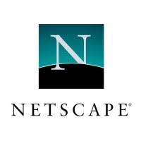

# SMX2-M8UF1A1-HistoriaWeb-2010-Netscape-ErickGutierrez
## ¿Que es?
### Netscape fue uno de los primeros navegadores más ingluyentes de los primero días de Internet. 

## ¿Quien lo creo?
|Origen|Foto del creador|
|------------------------|--------------------|
|Netscape fue creado por NCC (*Netscape Communications Corporation*), una compañia fundada por Marc Andreesen y Jim Clark.   ||

### *Marc Andreesen*
 Es un empresiorio e inversor de capital de riesgo, estadounidense conocido por su contribución significativa al desarrollo del *WWW*. Este señor nació el 9 de julio de 1971. Este fue el desarrollador del navegador Mosaic, mientras fue estudiante en el Universidad de Illions a principios de la década de 1990. Tambien es co-fundador de Netscape, junto a Jim Clark, Marc Andreessen co-fundó Netscape Communications.

